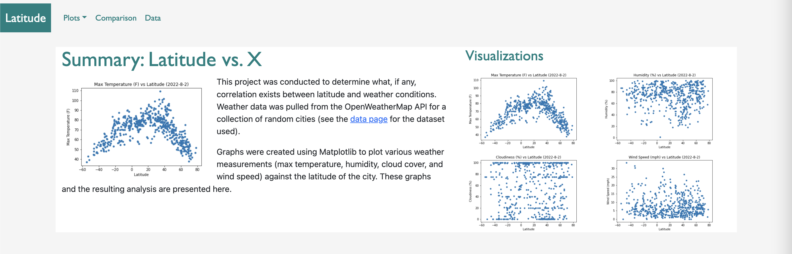

# Latitude
Web Design Challenge - Homework 11 for University of Minnesota Data Boot Camp

This site was created using [Bootstrap](https://getbootstrap.com/) and displays the result of data analyzed in [Homework 6](https://github.com/anyren/python-api-challenge).  

The site can be found at https://anyren.github.io/web-design-challenge/index.html

Guide to repo:
* `index.html` is the landing page for the website
* `comparison.html` features larger versions of all four graphs that can then be clicked through for further detail
* the raw data csv can be found in the `resources` directory and is displayed using the `data.html` file on the webpage
* `visualizations` directory contains the HTML files for the detailed analysis of each graph
* `assets` directory contains the `css` and `images` directories that contain the style sheets and graph images respectively

